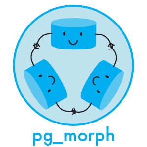

[](https://travis-ci.org/LunarLogic/pg_morph)
[](https://codeclimate.com/github/LunarLogic/pg_morph)
[](https://codeclimate.com/github/LunarLogic/pg_morph)

# PgMorph
# 

PgMorph gives you a way to handle DB consistency for polymorphic relations and is based on postgreSQL inheritance and partitioning features.

## Requirements

postgresql >= 9.2

## Installation

Add this line to your application's Gemfile:

```ruby
gem 'pg_morph'
```

And then execute:

```console
$ bundle
```

Or install it yourself as:

```console
$ gem install pg_morph
```

## Usage

Let's say you have a `Like` class and it's in polymorphic relation with `Post` and `Comment` classes. You can't add foreign keys for those relations, and there's where PgMorph comes.

By adding migration:

```ruby
add_polymorphic_foreign_key :likes, :comments, column: :likeable
```

At first PgMorph wants to use `likes` table view instead of normal table as a master one. To prevent braking all potential relations with other tables it renames `likes` table to `likes_base` and then creates a view of `likes_base` named `likes`.
PgMorph then creates a partition table named `likes_comments` which inherits from `likes_base` table, sets foreign key on it and redirects all inserts to `likes` - since this is the table name AR knows aobut - to this partition table if `likeable_type` is `Comment`. It's done by using before insert trigger.

You will have to add polymorphic foreign key on all related tables and each time new relation is added, before insert trigger function will be updated to reflect all defined relations and redirect new records to proper partitions.

From the Rails point of view it's totally transparent, so all inserts, updates and selections work as they were on original `likes` table.

You can remove polymorphic foreign keys with below migration:

```ruby
remove_polymorphic_foreign_key :likes, :comments, column: :likeable
```

Because it means that whole partition table would be removed, you will be forbidden to do that if partition table contains any data.

## Caveats

While updating records check constraints which are set on each partition does not allow to change association type, so if in examplary model some like is for a comment, it can't be reassigned to a post, postgres will raise an exception.

## Development plan

- support moving records between partitions while updating relation type
- your suggestions?

## Contributing

1. Fork it
2. Create your feature branch (`git checkout -b my-new-feature`)
3. Commit your changes (`git commit -am 'Add some feature'`)
4. Push to the branch (`git push origin my-new-feature`)
5. Create new Pull Request
